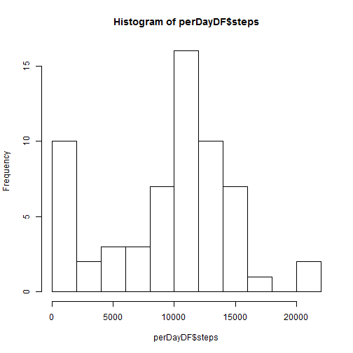
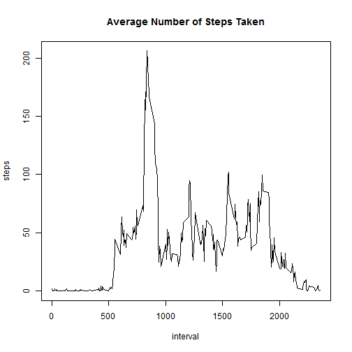
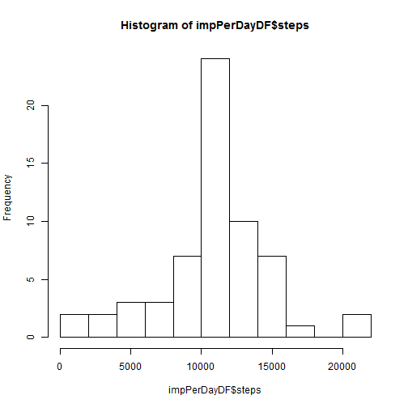
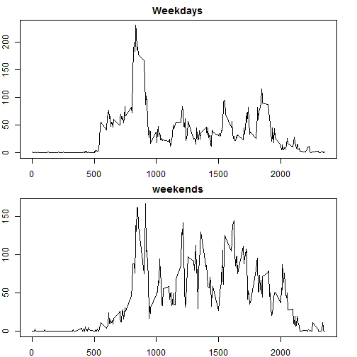

#Project 1
###Reproducible Research  

###Code for reading and Processing the data

Here is the code for processing the data:


```r
activity <- read.csv("activity.csv")
activity$date2 <- as.character(activity$date)
activity$date3 <- as.Date(activity$date2, format = "%Y-%m-%d")
activity$date <- NULL
activity$date2 <- NULL
```

###Steps Per day:


```r
perDayDF <- as.data.frame(as.matrix(tapply(activity$steps, activity$date3, sum, na.rm = TRUE)))
perDayDF$day <- names(tapply(activity$steps, activity$date3, sum, na.rm = TRUE))
names(perDayDF) <- c("steps", "day")

##hist, mean, median

hist(perDayDF$steps, breaks = 10)
```

 

```r
mean(perDayDF$steps)
```

```
## [1] 9354.23
```

```r
median(perDayDF$steps)
```

```
## [1] 10395
```

###Average Activity Pattern:


```r
fiveMinIntDF <- as.data.frame(as.matrix(tapply(activity$steps, activity$interval, mean, na.rm = TRUE)))
fiveMinIntDF$interval <- names(tapply(activity$steps, activity$interval, mean, na.rm = TRUE))
names(fiveMinIntDF) <- c("steps", "interval")

##plot, find max

with(fiveMinIntDF, plot(interval, steps, type = "l", main = "Average Number of Steps Taken"))
```

 

The 5-min interval in which the average number of steps is maximal:

```r
fiveMinIntDF$interval[which.max(fiveMinIntDF$steps)]
```

```
## [1] "835"
```


###Imputing missing values:
The number of NA values in the dataset:


```r
sum(is.na(activity$steps))
```

```
## [1] 2304
```

I choose to fill the NAS with the average value of the interval for which the steps' value is missing:


```r
getIntervalMean <- function(interval_b){
    mean(activity$steps[activity$interval == interval_b], na.rm = TRUE)
    
}


imputedActivity <- activity

imputedActivity$steps[is.na(imputedActivity$steps)] <- sapply(activity$interval, getIntervalMean)
```

```
## Warning in imputedActivity$steps[is.na(imputedActivity$steps)] <-
## sapply(activity$interval, : number of items to replace is not a multiple of
## replacement length
```

These are the histogram, mean, and median for the imputed data:


```r
impPerDayDF <- as.data.frame(as.matrix(tapply(imputedActivity$steps, imputedActivity$date3, sum, na.rm = TRUE)))
impPerDayDF$day <- names(tapply(imputedActivity$steps, imputedActivity$date3, sum, na.rm = TRUE))
names(impPerDayDF) <- c("steps", "day")

##hist, median, mean

hist(impPerDayDF$steps, breaks = 10)
```

 

```r
mean(impPerDayDF$steps)
```

```
## [1] 10766.19
```

```r
median(impPerDayDF$steps)
```

```
## [1] 10766.19
```

We can see that after imputing the data, the mean and the median slightly increased.

Here is the code for analysing the effect of weekday/weekend:


```r
Sys.setlocale("LC_TIME", "English")
```

```
## [1] "English_United States.1252"
```

```r
library(lubridate)
imputedActivity$day <- wday(imputedActivity$date3)
imputedActivity$day_type <- "weekday"
imputedActivity$day_type[imputedActivity$day == 1 | imputedActivity$day == 7] <- "weekend"
imputedActivity$day_type <- as.factor(imputedActivity$day_type)


df_weekdays <- subset(imputedActivity, day > 1 & day < 7)
df_weekend <- subset(imputedActivity, day == 1 | day == 7)
```

Here is the panel plot showing the difference:

```r
calc_weekdays <-  as.data.frame(as.matrix(with(df_weekdays, tapply(steps, interval, mean))))
calc_weekdays$interval <- names(with(df_weekdays, tapply(steps, interval, mean)))

calc_weekends <-  as.data.frame(as.matrix(with(df_weekend, tapply(steps, interval, mean))))
calc_weekends$interval <- names(with(df_weekend, tapply(steps, interval, mean)))

par(mfrow = c(2, 1), mar = c(2, 2, 2, 2))
with(calc_weekdays, plot(interval, V1, type = "l", main = "Weekdays"))
with(calc_weekends, plot(interval, V1, type = "l", main = "weekends"))
```

 

And here is all the code:

```r
activity <- read.csv("activity.csv")
activity$date2 <- as.character(activity$date)
activity$date3 <- as.Date(activity$date2, format = "%Y-%m-%d")
activity$date <- NULL
activity$date2 <- NULL

perDayDF <- as.data.frame(as.matrix(tapply(activity$steps, activity$date3, sum, na.rm = TRUE)))
perDayDF$day <- names(tapply(activity$steps, activity$date3, sum, na.rm = TRUE))
names(perDayDF) <- c("steps", "day")

##hist, mean, median

hist(perDayDF$steps, breaks = 10)
```

 

```r
mean(perDayDF$steps)
median(perDayDF$steps)


fiveMinIntDF <- as.data.frame(as.matrix(tapply(activity$steps, activity$interval, mean, na.rm = TRUE)))
fiveMinIntDF$interval <- names(tapply(activity$steps, activity$interval, mean, na.rm = TRUE))
names(fiveMinIntDF) <- c("steps", "interval")

##plot, find max

with(fiveMinIntDF, plot(interval, steps, type = "l", main = "Average Number of Steps Taken"))
```

 

```r
fiveMinIntDF$interval[which.max(fiveMinIntDF$steps)]

##calc na's

sum(is.na(activity$steps))


getIntervalMean <- function(interval_b){
    mean(activity$steps[activity$interval == interval_b], na.rm = TRUE)
    
}


imputedActivity <- activity

imputedActivity$steps[is.na(imputedActivity$steps)] <- sapply(activity$interval, getIntervalMean)
```

```
## Warning in imputedActivity$steps[is.na(imputedActivity$steps)] <-
## sapply(activity$interval, : number of items to replace is not a multiple of
## replacement length
```

```r
impPerDayDF <- as.data.frame(as.matrix(tapply(imputedActivity$steps, imputedActivity$date3, sum, na.rm = TRUE)))
impPerDayDF$day <- names(tapply(imputedActivity$steps, imputedActivity$date3, sum, na.rm = TRUE))
names(impPerDayDF) <- c("steps", "day")

##hist, median, mean

hist(impPerDayDF$steps, breaks = 10)
```

 

```r
mean(impPerDayDF$steps)
median(impPerDayDF$steps)


Sys.setlocale("LC_TIME", "English")
library(lubridate)
imputedActivity$day <- wday(imputedActivity$date3)
imputedActivity$day_type <- "weekday"
imputedActivity$day_type[imputedActivity$day == 1 | imputedActivity$day == 7] <- "weekend"
imputedActivity$day_type <- as.factor(imputedActivity$day_type)


df_weekdays <- subset(imputedActivity, day > 1 & day < 7)
df_weekend <- subset(imputedActivity, day == 1 | day == 7)

calc_weekdays <-  as.data.frame(as.matrix(with(df_weekdays, tapply(steps, interval, mean))))
calc_weekdays$interval <- names(with(df_weekdays, tapply(steps, interval, mean)))

calc_weekends <-  as.data.frame(as.matrix(with(df_weekend, tapply(steps, interval, mean))))
calc_weekends$interval <- names(with(df_weekend, tapply(steps, interval, mean)))

par(mfrow = c(2, 1), mar = c(2, 2, 2, 2))
with(calc_weekdays, plot(interval, V1, type = "l", main = "Weekdays"))
with(calc_weekends, plot(interval, V1, type = "l", main = "weekends"))
```

 
